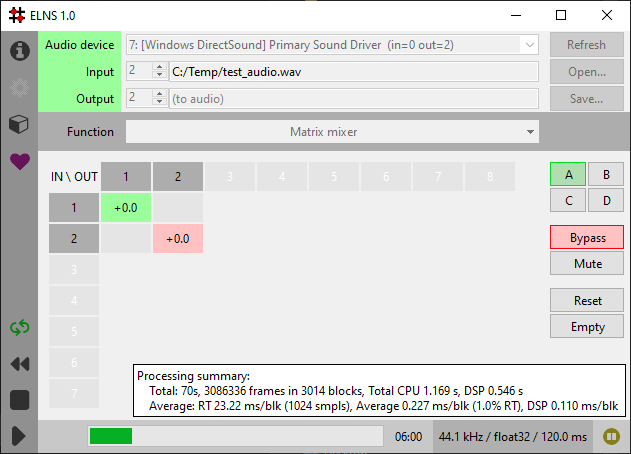

ELNS
====

.. toctree::
   :maxdepth: 2
   :caption: Contents:

ELNS is a tool for processing multi-channel audio, supporting interactive
adjustments of audio parameters during processing. It processes live audio to
and from a file or sound card in real-time.

The tool comes with a set of audio processing functions, each written to test
or demonstrate specific features. The DSP engine support a wide range of
samplerates, including high-res rates, and it supports processing audio up to
32-bit resolution.

The tool provides a tkinter based used interface to set up the audio and
file input/output and to adjust audio parameters interactively during processing.

Features
========

* Selectable processing audio functions, each built for a specific purpose or
  demonstration.
* Reads and writes a wide range of file formats, including lossless format such
  as *flac*
* Full-duplex sound card input and output
* Interactive real-time adjustment of parameters
* Supports multi-channel audio, up to 8 channels
* Supports high sample rates
* Process audio in high bit resolutions, up to 32-bits per sample

Technology
==========

* ELNS is written in Python 3
* UI is implemented in Tk
* `SciPy and NumPy <http://scipy.org>`_ for numerical processing
* `Portaudio <http://portaudio.com>`_ and
  `PyAudio <https://people.csail.mit.edu/hubert/pyaudio/>`_ for audio interface
* `libsndfile <http://www.mega-nerd.com/libsndfile/>`_ and
  `pysndfile <https://forge-2.ircam.fr/roebel/pysndfile>`_ for audio file IO

Download
========

ELNS can be downloaded from https://github.com/sveinse/elns-release/releases

Indices and tables
==================

* :ref:`genindex`
* :ref:`modindex`
* :ref:`search`
